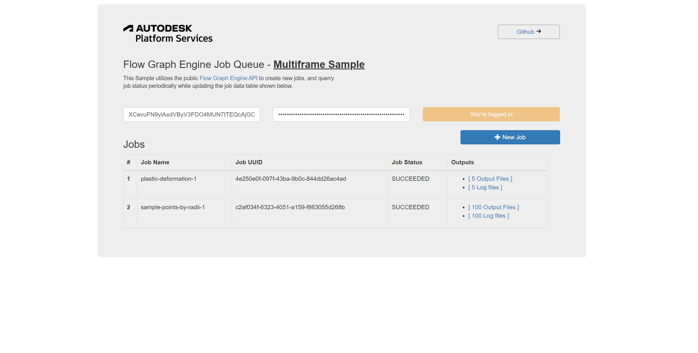
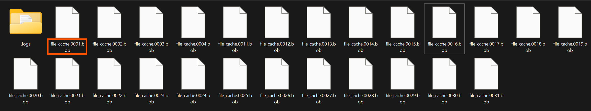
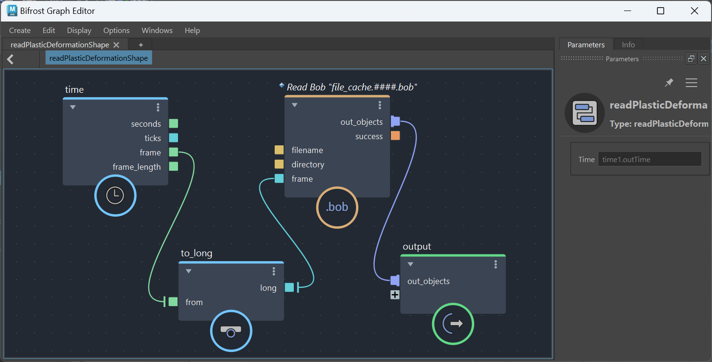
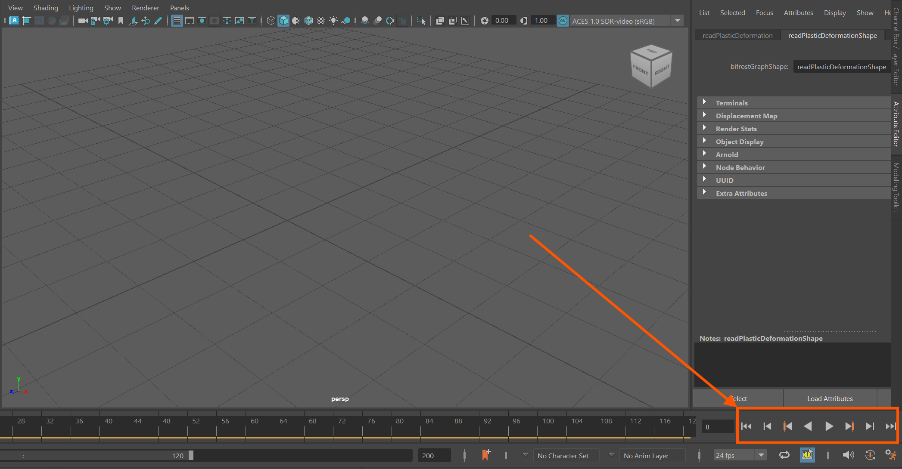

# Flow Graph Engine Job Queue

[](https://nodejs.org/)
[](https://www.npmjs.com/)

[](https://opensource.org/licenses/MIT)


This utility app enables you to view and create bifrost jobs, which are submitted to the Flow Graph Engine service. This sample processes multiframe Bifrost simulation jobs and fetches the resultant frames which can then be used in Autodesk Maya.

### Thumbnail



## Table of Contents
- [Flow Graph Engine Job Queue](#flow-graph-engine-job-queue)
  - [Thumbnail](#thumbnail)
- [Using the Sample's Web UI](#using-the-samples-web-ui)
- [Bundled Bifrost Graphs Samples](#bundled-bifrost-graphs-samples)
- [Running Generated Files](#running-generated-files)
- [Development Setup](#development-setup)
  - [Prerequisites](#prerequisites)
  - [Run locally](#run-locally)
  - [Packages used](#packages-used)
  - [Tips & tricks](#tips--tricks)
  - [Further Reading](#further-reading)
- [Known Issues](#known-issues)
- [Limitation](#limitation)
- [License](#license)


# Using the Sample's Web UI
As a pre-requisite, this section assumes you already have the development/production server already running. See [Development Setup](#development-setup) section below on how to setup the project and start the dev server.

1. In the top text boxes Provide the **Client Id** and **Client Secret** of the app you created on the **Autodesk Developer Site** and click **Log In** button. Alternatively, you can use this URL format to pass in your credentials ```http://localhost:3000?client_id=<client id here>&client_secret=<client secret here>```.

2. Once logged in (authenticated), we can start adding new jobs by clicking on the **New Job** button button to open the create job window.

    

3. In the popup, fill in the **Job Name** as you like, then select the **Bifrost File**, the **Start & End Frames** and then submit the form. This consequently will begin the process of submitting the new job. 
4. On successful job submission, the **Job Id** is returned and shown on the dashboard. Automatically, this will querry for the job status periodically and the new **status** updated on the dashboard as shown above.
5. When the job has been processed, whether ***FAILED*** or ***SUCCEEDED***, the corresponding output files and logs will be shown on the output column. The output column will indicate the number of output files and/or number of log files generated by the service. On clicking on it, the directory where the files have been saved to will be copied to clipboard.

    

6. You can navigate to the directory where the files have been saved to to check the files/logs. Note that, the job ID is is the parent directory name to the downloaded files.

> Note that: Depending on the number of files to be fetched, the fetch process may complete later than than the response to the UI. **Countercheck the number of files in the directory vs the number of files noted on the web UI**.

# Bundled Bifrost Graphs Samples
This sample has two Bifrost samples which are found in the Autodes Maya's Bifrost Browser. You can select the samples when creating a new job:
- Plastic Deformation Sample: [```./input-samples/input-samples\plasticDeformationShape.json```](input-samples\plasticDeformationShape.json)
- Sample Points By Radius[```./input-samples/samplePointsByRadiusShape.json```](input-samples\samplePointsByRadiusShape.json)
- Helix Rubber Simulation: [```./input-samples/rubberHelixShape.json```](./input-samples/rubberHelixShape.json)

# Running Generated Files
If evaluation on FGE was successful and files have been fetched locally, you can load the files back to Maya using the following graph. Note that the file formats for this sample were hardcoded to Bifrost Object format (.bob). Since generated files are a sequence, the filename for the Read bob is given as ```_directory_/file_cache.####.bob``` where the '####' will be expanded to the respective frame number. 



Given the output as shown above, if the directory here is for instance ```K:/some/path/uuid/```, then the _Read Bob_ node below will be set to have a filename input port set to ```K:/some/path/uuid/file_cache.####.bob```. When simulation is run, the path will be expanded to ```K:/some/path/uuid/file_cache.0001.bob```when the slider is at frame 1.



The time node provides for time value access from the host system, which is converted to a ```long``` values since the frame number expected by the ```Read Bob File``` node is expected as a ```long``` value.

To run the simulation in Maya, use the slider controls to step frame by frame or run through all frames.



# Development Setup

## Prerequisites

1. **APS Account**: Learn how to create a APS Account, activate subscription and create an app at [this tutorial](https://tutorials.autodesk.io/). 
2. **Visual Studio Code**: Or any other code editor of your choice.
3. **JavaScript** basic knowledge with **jQuery**

### Run locally

Install [NodeJS](https://nodejs.org).

Clone this project or download it. To clone it via command line, use the following (**Terminal** on MacOSX/Linux, **Git Shell** on Windows):

    git clone https://github.com/allankoechke/flowgraphengine-queue
    git checkout multiframe

To run it, install the required packages, set the enviroment variables with your client ID & secret and finally start it. Via command line, navigate to the folder where this repository was cloned and use the following:

Mac OSX/Linux (Terminal) / Windows (use <b>Node.js command line</b> from Start menu)

    npm install
    npm start

Open the browser: [http://localhost:3000](http://localhost:3000?client_id=<client id here>&client_secret=<client secret here>).

## Packages used

The packages used include [express](https://www.npmjs.com/package/express) and its file uploading middlewares. The front-end uses [bootsrap](https://www.npmjs.com/package/bootstrap) and [jquery](https://www.npmjs.com/package/jquery).

## Tips & tricks

For local development/testing, consider use [nodemon](https://www.npmjs.com/package/nodemon) package, which auto restart your node application after any modification on your code. To install it, use:

    sudo npm install -g nodemon

Then, instead of <b>npm run dev</b>, use the following:

    npm run nodemon

Which executes **nodemon server.js --ignore www/ files/**, where the **--ignore** parameter indicates that the app should not restart if files under **www** folder are modified.

## Further Reading

Documentation:
- [Bifrost Help](https://help.autodesk.com/view/BIFROST/ENU/)
- [Flow Graph Engine](https://aps.autodesk.com/developer/overview/flow-graph-engine-api)

Blogs:
- [Flow Graph Engine Announcement](https://aps.autodesk.com/blog/introducing-first-me-oriented-aps-service-flow-graph-engine)

## Known Issues
- There is no persistent credential storage nor token storage. Authetication has to be done on each reload or restart.
- Jobs that fail on uploading can't be resubmitted, unless as a new job.

## Limitation
This sample does not expect any user file input apart from the bifrost graph itself. You can edit the sample to accomodate other input types.

## License

This sample is licensed under the terms of the [MIT License](http://opensource.org/licenses/MIT).
Please see the [LICENSE](LICENSE) file for full details.

