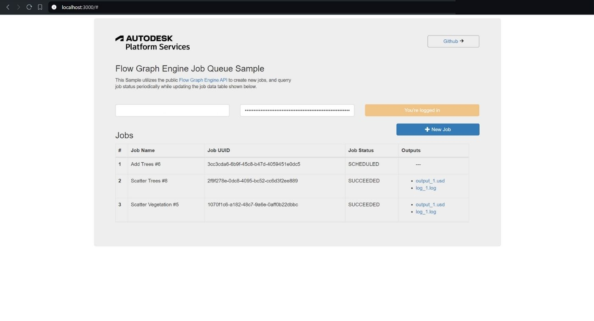

# Flow Graph Engine Job Queue

This utility app enables you to view and create bifrost jobs, which are submitted to the Flow Graph Engine service.

### Thumbnail

# Usage

1. In the top text boxes Provide the **Client Id** and **Client Secret** of the app you created on the **Autodesk Developer Site** and click **Log In** button

2. Once logged in (authenticated), we can start adding new jobs by clicking on the **New Job** button button to open the create job window.

3. In the popup, fill in the **Job Name** as you like, then select the **Bifrost File** and the **Input file** and submit the form. This consequently will begin the process of submitting the new job. 
4. On successful job submission, the *Job Id** is returned and shown on the dashboard. Automatically, this will querry for the job status periodically and the new **status** updated on the dashboard as shown above.
5. When the job has been processed, whether ***FAILED*** or ***SUCCEEDED***, the corresponding output files and logs will be shown on the output column. Here, to fetch the files, click on the link which will fetch the file link and initiate the download. Depending on the expected file type, (.txt/.log for log files or .usd/etc for resultant files), save the file with the correct file extension as shown below.

6. Once saved, you can open the respective files with the appropriate tools. If the processing failed, you can peek at the log file to know what went wrong in the execution. 

# Setup

## Prerequisites

1. **APS Account**: Learn how to create a APS Account, activate subscription and create an app at [this tutorial](https://tutorials.autodesk.io/). 
2. **Visual Studio Code**: Or any other code editor of your choice.
3. **JavaScript** basic knowledge with **jQuery**

### Run locally

Install [NodeJS](https://nodejs.org).

Clone this project or download it. To clone it via command line, use the following (**Terminal** on MacOSX/Linux, **Git Shell** on Windows):

    git clone https://github.com/allankoechke/flowgraphengine-queue

To run it, install the required packages, set the enviroment variables with your client ID & secret and finally start it. Via command line, navigate to the folder where this repository was cloned and use the following:

Mac OSX/Linux (Terminal) / Windows (use <b>Node.js command line</b> from Start menu)

    npm install
    npm start

Open the browser: [http://localhost:3000](http://localhost:3000).

**Important:** do not use **npm start** locally, this is intended for PRODUCTION only with HTTPS (SSL) secure cookies.

## Packages used

The packages used include [express](https://www.npmjs.com/package/express) and its file uploading middlewares. The front-end uses [bootsrap](https://www.npmjs.com/package/bootstrap) and [jquery](https://www.npmjs.com/package/jquery).

## Tips & tricks

For local development/testing, consider use [nodemon](https://www.npmjs.com/package/nodemon) package, which auto restart your node application after any modification on your code. To install it, use:

    sudo npm install -g nodemon

Then, instead of <b>npm run dev</b>, use the following:

    npm run nodemon

Which executes **nodemon server.js --ignore www/ files/**, where the **--ignore** parameter indicates that the app should not restart if files under **www** folder are modified.

## Further Reading

Documentation:

- [Bifrost Help](https://help.autodesk.com/view/BIFROST/ENU/)
- [Flow Graph Engine](https://aps.autodesk.com/developer/overview/flow-graph-engine-api)

Blogs:
- [Flow Graph Engine Announcement](https://aps.autodesk.com/blog/introducing-first-me-oriented-aps-service-flow-graph-engine)

## Known Issues
- The resultant file downloads dont come with the correct file extensions, you have to affix them on the file save dialog.
- There is no persistent credential storage nor token storage. Authetication has to be done on each reload or restart.
- Jobs that fail on uploading can be resubmitted, unless as a new job.

## License

This sample is licensed under the terms of the [MIT License](http://opensource.org/licenses/MIT).
Please see the [LICENSE](LICENSE) file for full details.

